# Messanzeigen für vis-2

Zehn Widgets, die einen Wert als Anzeige darstellen: ein farbiger Halbkreis mit Nadel, ein Kreis mit Flüssigkeit,
eine Batterie, ein Rundinstrument, ein moderner Bogen, ein Balken, ein Thermometer, ein Kompass, ein Tank und
konzentrische Ringe.

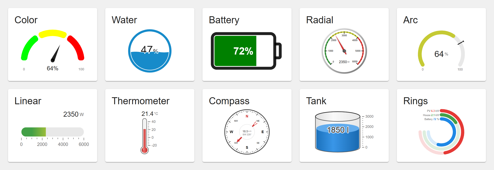

**Inhalt**

- [Allgemeines](#allgemeines)
    - [Voraussetzungen](#voraussetzungen)
    - [Projekte aus Version 2.0](#projekte-aus-version-20)
    - [Gemeinsame Einstellungen](#gemeinsame-einstellungen)
    - [Farben und Stufen](#farben-und-stufen)
    - [Animation](#animation)
    - [Dunkles Design](#dunkles-design)
- [Farbskala](#farbskala---tplgauge2color)
- [Flüssigkeitsanzeige](#flüssigkeitsanzeige---tplgauge2water)
- [Batterieanzeige](#batterieanzeige---tplgauge2battery)
- [Rundinstrument](#rundinstrument---tplgauge2radial)
- [Bogenanzeige](#bogenanzeige---tplgauge2arc)
- [Linearanzeige](#linearanzeige---tplgauge2linear)
- [Thermometer](#thermometer---tplgauge2thermometer)
- [Kompass](#kompass---tplgauge2compass)
- [Tank](#tank---tplgauge2tank)
- [Ringe](#ringe---tplgauge2rings)

## Allgemeines

### Voraussetzungen

Die Widgets stehen im vis-2-Editor im Widget-Satz **Messanzeigen**. Sie brauchen den Adapter vis-2; vis (vis-1) kann
sie nicht anzeigen.

In den Tabellen ist **Einstellung** die Beschriftung im vis-2-Editor und **Attribut** der Name, unter dem der Wert im
Projekt gespeichert wird. Den Attributnamen braucht man, wenn man ein Projekt als JSON bearbeitet oder Einstellungen
zwischen Widgets kopiert. **Standard** ist das, was ein Widget bei leerem Feld verwendet; bei einem neuen Widget trägt
der Editor die Standardwerte der mit *(neues Widget)* markierten Einstellungen bereits ein.

### Projekte aus Version 2.0

Version 2.0 hat Farbskala, Flüssigkeits- und Batterieanzeige mit den Bibliotheken react-gauge-chart,
react-liquid-gauge und react-battery-gauge (alle auf Basis von d3) gezeichnet. Diese Bibliotheken sind entfernt, die
Widgets sind jetzt reines SVG - kleiner, schneller und passend zur React-Version des aktuellen vis-2. Widget-IDs und
alle Attributnamen sind gleich geblieben, bestehende Projekte behalten ihre Einstellungen. Einiges sieht anders aus:

- **Farbskala**: Der Wert steht unter der Achse der Nadel statt hinter der Nadel. Minimum und Maximum können an den
  Enden der Skala angezeigt werden. *Nadellänge* funktioniert jetzt. Ein Eckenradius, ein Segmentabstand oder ein
  Außenabstand von `0` ist jetzt wirklich 0 - vorher bedeutete `0` den Standardwert.
- **Farbskala**: Eine leere *Einheit* zeigt keine Einheit an. Nur ein Widget, bei dem die Einheit nie gesetzt wurde,
  zeigt wie bisher `%`.
- **Flüssigkeitsanzeige**: Der Wert wurde mit allen Nachkommastellen angezeigt; jetzt mit höchstens zwei oder so
  vielen, wie in *Nachkommastellen* eingestellt. Während der Steig-Animation zählt die Zahl mit.
- **Batterieanzeige**: In einer senkrechten Batterie bleibt der Text waagerecht, der Ladeblitz steht aufrecht.
- Ein Wert, der keine Zahl ist (z. B. `offline`), wird als Text angezeigt; ein Zustand ohne Wert zeigt `–`.

### Gemeinsame Einstellungen

| Einstellung | Attribut | Standard | Beschreibung |
|---|---|---|---|
| Ohne Karte | `noCard` | aus | Zeichnet die Anzeige direkt auf die View. Sonst sitzt sie wie die anderen vis-2-Widgets in einer Karte. |
| Titel | `widgetTitle` | | Überschrift der Karte. |
| Objekt-ID | `oid` | | Der anzuzeigende Zustand. Beim Auswählen werden die Einheit und - falls das Objekt sie festlegt - Minimum und Maximum übernommen. Statt einer ID nimmt das Feld auch eine Konstante: eine Zahl wird als Wert angezeigt, ein Wort ohne Punkt als Text. |
| Minimalwert / Maximalwert | `min` / `max` | 0 / 100 | Bereich der Skala. Werte außerhalb bleiben am Ende stehen. |
| Einheit | `unit` | | Wird hinter dem Wert angezeigt. |
| Nachkommastellen | `digitsAfterComma` | | Leer: so viele wie nötig, höchstens zwei. Das Dezimaltrennzeichen folgt den Systemeinstellungen von ioBroker. |

Die Textfarbe aus dem Stil eines Widgets (`color`) wird für den Wert verwendet, wenn das Widget keine eigene Textfarbe
hat.

### Farben und Stufen

Die meisten Anzeigen färben ihre Skala oder ihren Wert nach **Stufen**. Alle Widgets beschreiben die Stufen gleich:

| Einstellung | Attribut | Beschreibung |
|---|---|---|
| Anzahl der Stufen | `levelsCount` | Anzahl der Stufen. Für jede Stufe gibt es eine Gruppe *Stufe 1*, *Stufe 2*, ... |
| Farbe | `color1` ... `colorN` | Farbe der Stufe. Hat nicht jede Stufe eine Farbe, laufen die Farben von der ersten zur letzten gesetzten; ganz ohne Farben von Grün über Gelb nach Rot. |
| Stufengrenze | `levelThreshold1` ... `levelThreshold(N-1)` | Absoluter Wert, bei dem die Stufe endet. Die letzte Stufe endet immer beim Maximum. Eine leere Grenze teilt den Rest der Skala gleichmäßig auf. |

Bogen, Linearanzeige, Thermometer und Tank haben zusätzlich eine **Einfärbung** (`colorMode`):

| Wert | Beschreibung |
|---|---|
| Eine Farbe (`fixed`) | Der Wert hat immer die *Farbe* (`valueColor`). |
| Farbe der Stufe (`levels`) | Der Wert bekommt die Farbe der Stufe, in der er liegt. |
| Verlauf der Stufen (`gradient`) | Die Farben der Stufen gehen ineinander über. |

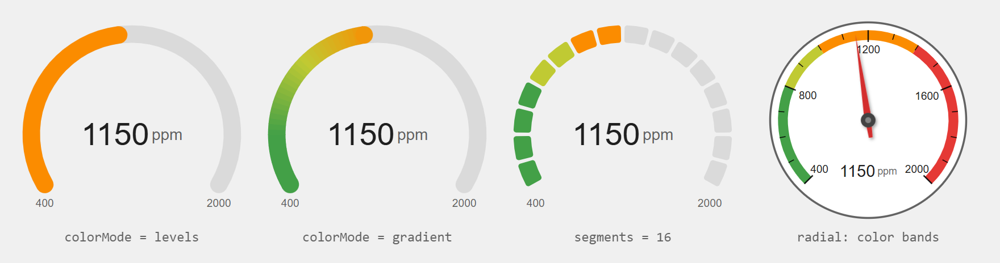

Das Beispiel: CO₂ von 400 bis 2000 ppm mit vier Stufen (`levelThreshold1` = 800, `levelThreshold2` = 1000,
`levelThreshold3` = 1400) in der Bogenanzeige mit jeder Einfärbung, in Segmenten und als Farbbänder des
Rundinstruments.

### Animation

Die neuen Widgets bewegen sich weich zum neuen Wert:

| Einstellung | Attribut | Standard | Beschreibung |
|---|---|---|---|
| Animieren | `animate` | an *(neues Widget)* | Ohne springt der Wert. |
| Animationsdauer | `animateDuration` | je nach Widget | Dauer in ms. |
| Animationsverlauf | `animationEasing` | je nach Widget | Verlauf der Bewegung: `linear`, `quadIn`, `cubicOut`, `backOut` (schießt etwas über), `elasticOut` (schwingt), `bounceOut` (prallt ab), ... - die Verläufe von d3. |

### Dunkles Design

Im dunklen Design von vis-2 folgen alle nicht gesetzten Farben dem Design: Text, Skalen, die leere Spur eines Bogens,
das Zifferblatt von Rundinstrument und Kompass. Gesetzte Farben bleiben, wie sie sind.

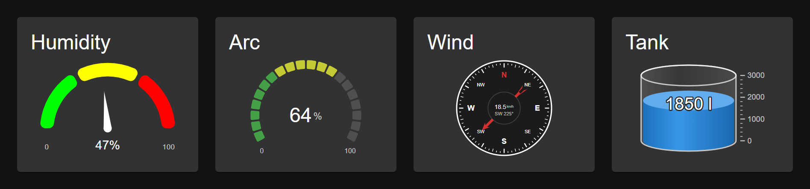

## Farbskala - `tplGauge2Color`

Ein Halbkreis aus farbigen Segmenten mit Nadel.

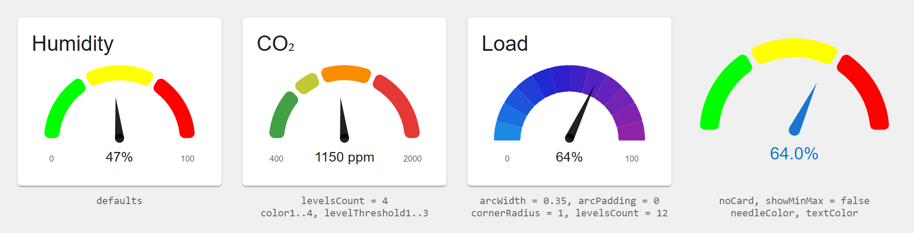

| Einstellung | Attribut | Standard | Beschreibung |
|---|---|---|---|
| Anzahl der Stufen | `levelsCount` | 3 | Anzahl der farbigen Segmente, siehe [Farben und Stufen](#farben-und-stufen). Ohne Farben laufen sie von Grün über Gelb nach Rot. |
| Nachkommastellen | `digitsAfterComma` | 2 *(neues Widget)* | |
| Einheit | `unit` | `%`, wenn nie gesetzt | |
| Nadelfarbe | `needleColor` | Textfarbe | |
| Farbe des Nadelfußes | `needleBaseColor` | Textfarbe | |
| Nadellänge | `needleScale` | 0,55 | Länge als Anteil am Radius. |
| Außenabstand | `marginInPercent` | 0,05 | Platz um die Anzeige als Anteil an der Widgetgröße. |
| Eckenradius | `cornerRadius` | 6 | Abrundung der Segmente in px. |
| Abstand der Segmente | `arcPadding` | 0,05 | Lücke zwischen den Segmenten, im Bogenmaß. |
| Bogenbreite | `arcWidth` | 0,2 | Dicke des Bogens als Anteil am Radius. |
| Wert ausblenden | `hideText` | aus | |
| Textfarbe | `textColor` | Textfarbe | Farbe des Werts. |
| Minimum und Maximum zeigen | `showMinMax` | an *(neues Widget)* | Minimum und Maximum an den Enden des Bogens. |
| Animieren | `animate` | an *(neues Widget)* | Die Nadel schwingt zum neuen Wert. |
| Animationsverzögerung | `animDelay` | 500 | Wartezeit in ms, bevor sich die Nadel bewegt. |
| Animationsdauer | `animateDuration` | 3000 | Dauer in ms. |

## Flüssigkeitsanzeige - `tplGauge2Water`

Ein Kreis, der sich mit einer wogenden Flüssigkeit füllt.

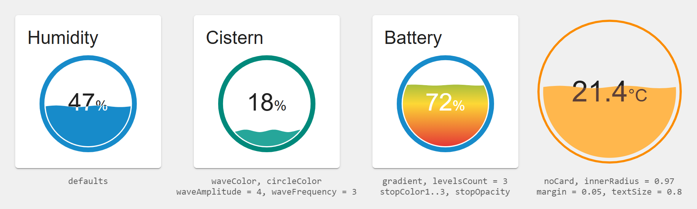

| Einstellung | Attribut | Standard | Beschreibung |
|---|---|---|---|
| Größe | `size` | | Durchmesser in px. Leer: passt sich dem Widget an. |
| Nachkommastellen | `digitsAfterComma` | | Leer: höchstens zwei. |
| Textgröße | `textSize` | 1 | Relative Größe des Werts; 1 ist der halbe Radius. Die Einheit ist 60 % davon. |
| Textversatz x / y | `textOffsetX` / `textOffsetY` | 0 / Durchmesser ÷ 15 | Verschiebt den Wert in px. |
| Animation beim Steigen | `riseAnimation` | an *(neues Widget)* | Die Flüssigkeit steigt auf den neuen Stand; die Zahl zählt mit. |
| Dauer der Steig-Animation | `riseAnimationTime` | 2000 | In ms. |
| Verlauf der Steig-Animation | `riseAnimationEasing` | `cubicInOut` | Siehe [Animation](#animation). |
| Wellenanimation | `waveAnimation` | an *(neues Widget)* | Die Wellen bewegen sich. |
| Dauer der Wellenanimation | `waveAnimationTime` | 2000 | Zeit in ms für eine ganze Welle. |
| Verlauf der Wellenanimation | `waveAnimationEasing` | `linear` | |
| Wellenanzahl | `waveFrequency` | 2 | Anzahl der Wellen über die Breite des Kreises. |
| Wellenhöhe | `waveAmplitude` | 1 | Höhe der Wellen in Prozent der Füllhöhe. Am höchsten sind sie bei 50 %, leer oder voll ist die Oberfläche glatt. |
| Innenradius / Außenradius | `innerRadius` / `outerRadius` | 0,9 / 1 | Der Ring um die Flüssigkeit, als Anteil am Radius. |
| Abstand | `margin` | 0,025 | Lücke zwischen Ring und Flüssigkeit. |
| Textfarbe | `textColor` | Textfarbe | Wert über der Flüssigkeit. |
| Textfarbe in der Flüssigkeit | `textWaveColor` | weiß | Der Teil des Werts, den die Flüssigkeit bedeckt. |
| Kreisfarbe | `circleColor` | blau | Farbe des Rings. |
| Farbe der Flüssigkeit | `waveColor` | blau | Farbe der Flüssigkeit, wenn kein Farbverlauf verwendet wird. |
| Farbverlauf | `gradient` | aus | Füllt die Flüssigkeit mit einem senkrechten Farbverlauf. |
| Anzahl der Stufen | `levelsCount` | | Anzahl der Verlaufspunkte. |

Jeder Verlaufspunkt (Gruppe *Stufe*):

| Einstellung | Attribut | Beschreibung |
|---|---|---|
| Farbe des Verlaufspunkts | `stopColor1` ... | |
| Deckkraft des Verlaufspunkts | `stopOpacity1` ... | 0 ist durchsichtig, 1 deckend (Standard). |
| Stufengrenze | `levelThreshold2` ... | Lage des Punkts als absoluter Wert. Der erste Punkt liegt immer unten, der letzte oben. |

## Batterieanzeige - `tplGauge2Battery`

Eine Batterie mit ihrem Ladezustand. Alle Längen sind in Einheiten der Zeichnung angegeben, die 100 breit ist. Bei
mehreren dieser Einstellungen gilt `0` als nicht gesetzt.

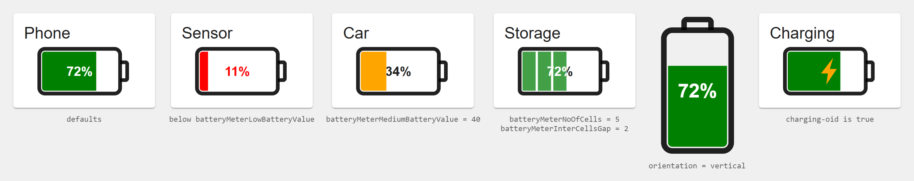

| Einstellung | Attribut | Standard | Beschreibung |
|---|---|---|---|
| Objekt-ID Laden | `charging-oid` | | Solange dieser Zustand `true` ist, zeigt die Batterie einen Blitz und füllt sich immer wieder. |
| Ausrichtung | `orientation` | waagerecht | `vertical` dreht die Batterie; der Text bleibt waagerecht. |
| Innenabstand | `padding` | 0 | Platz um die Batterie. |
| Größe | `size` | | Länge der Batterie in px. Leer: passt sich dem Widget an. |
| Seitenverhältnis | `aspectRatio` | 0,52 | Höhe als Anteil an der Länge: D = 0,56, C = 0,52, AA = 0,28, AAA = 0,23. |
| Animiert | `animated` | aus | Der Ladezustand wächst beim Erscheinen von 0 an. |

Der Text zeigt den Ladezustand in Prozent des Bereichs *Minimum* ... *Maximum*.

**Batteriekörper**, **Batteriepol**

| Einstellung | Attribut | Standard |
|---|---|---|
| Eckenradius | `batteryBodyCornerRadius` / `batteryCapCornerRadius` | 6 / 2 |
| Füllung | `batteryBodyFill` / `batteryCapFill` | keine |
| Linienfarbe | `batteryBodyStrokeColor` / `batteryCapStrokeColor` | Textfarbe |
| Linienstärke | `batteryBodyStrokeWidth` / `batteryCapStrokeWidth` | 4 / 4 |
| Verhältnis Pol zu Körper | `batteryCapCapToBodyRatio` | 0,4 |

**Füllanzeige**

| Einstellung | Attribut | Standard | Beschreibung |
|---|---|---|---|
| Füllung | `batteryMeterFill` | grün | |
| Schwache Batterie unter | `batteryMeterLowBatteryValue` | 15 % | In der Einheit des Werts. Darunter bekommen Anzeige und Text die Farben für schwache Batterie. |
| Füllung bei schwacher Batterie | `batteryMeterLowBatteryFill` | rot | |
| Mittlere Ladung unter | `batteryMeterMediumBatteryValue` | | Optionale dritte Stufe zwischen *schwach* und *voll*. |
| Füllung bei mittlerer Ladung | `batteryMeterMediumBatteryFill` | orange | |
| Innerer Abstand | `batteryMeterOuterGap` | 1 | Lücke zwischen Körper und Füllanzeige. |
| Anzahl der Zellen | `batteryMeterNoOfCells` | 1 | Mehr als 1 zeichnet einzelne Zellen; angezeigt werden nur volle Zellen. |
| Abstand zwischen den Zellen | `batteryMeterInterCellsGap` | 1 | |

**Text**

| Einstellung | Attribut | Standard | Beschreibung |
|---|---|---|---|
| Textfarbe auf dem leeren Teil | `readingTextLightContrastColor` | Textfarbe | |
| Textfarbe auf dem gefüllten Teil | `readingTextDarkContrastColor` | weiß | |
| Textfarbe bei schwacher Batterie | `readingTextLowBatteryColor` | rot | |
| Schriftart | `readingTextFontFamily` | Helvetica | |
| Schriftgröße | `readingTextFontSize` | 14 | 0 blendet den Text aus. |
| Prozentzeichen zeigen | `readingTextShowPercentage` | an | |

**Ladeblitz** (nur mit Objekt-ID Laden)

| Einstellung | Attribut | Standard | Beschreibung |
|---|---|---|---|
| Größe | `chargingFlashScale` | 1 | Größe des Blitzes. |
| Füllung | `chargingFlashFill` | orange | |
| Animiert | `chargingFlashAnimated` | an | Der Blitz blinkt. |
| Animationsdauer | `chargingFlashAnimationDuration` | 1000 | In ms. |

## Rundinstrument - `tplGauge2Radial`

Das klassische runde Messinstrument mit Skala, Farbbändern und Nadel - für Leistung, Geschwindigkeit, Druck oder
Temperatur.

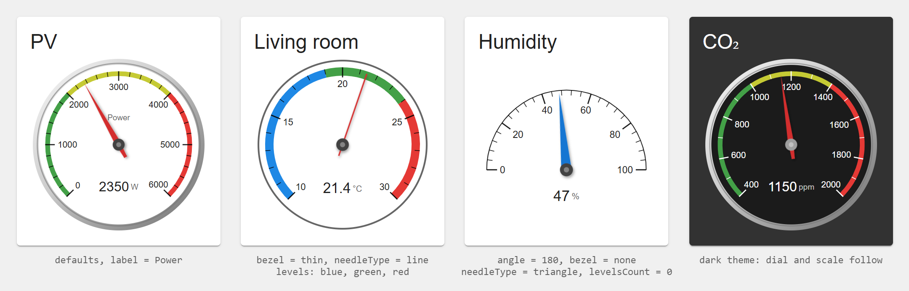

| Einstellung | Attribut | Standard | Beschreibung |
|---|---|---|---|
| Winkel der Skala | `angle` | 270 | Wie weit die Skala herumreicht: 180 ist ein Halbkreis, 360 ein Vollkreis. |
| Drehung | `rotate` | 0 | Dreht die Skala im Uhrzeigersinn; 0 ist symmetrisch nach oben. |
| Hauptteilungen | `majorTicks` | 10 | Anzahl der Abschnitte zwischen den beschrifteten Strichen. |
| Zwischenteilungen | `minorTicks` | 5 | Kleine Schritte innerhalb einer Hauptteilung. |
| Beschriftung zeigen | `showLabels` | an | Zahlen an den Hauptstrichen. |
| Farbe der Skala | `scaleColor` | Textfarbe | Striche und Zahlen. |
| Beschriftung auf dem Zifferblatt | `label` | | Kurzer Text in der oberen Hälfte, z. B. `Leistung`. |
| Farbe des Zifferblatts | `dialColor` | weiß / dunkel | Ohne Rand hat das Zifferblatt keinen Hintergrund, außer eine Farbe ist gesetzt. |
| Rand | `bezel` | Metall | `none`, `thin` (eine Linie in *Randfarbe*) oder `metal`. Ohne Rand wird nur die Skala ins Widget eingepasst, ein Halbkreis füllt es also aus. |
| Nadel | `needleType` | Pfeil | `arrow`, `line` oder `triangle`. |
| Nadelfarbe | `needleColor` | rot | |
| Farbe der Nabe | `hubColor` | dunkelgrau | |
| Wert zeigen | `showValue` | an | Wert und Einheit im unteren Teil des Zifferblatts. |
| Textfarbe | `textColor` | Textfarbe | |
| Anzahl der Stufen | `levelsCount` | 3 | Farbbänder entlang der Skala, siehe [Farben und Stufen](#farben-und-stufen). 0 zeichnet keine. |
| Breite des Farbbands | `bandWidth` | 0,06 | Als Anteil am Radius. |
| Animation | `animate`, `animateDuration`, `animationEasing` | an, 1000, `backOut` | Die Nadel schießt etwas über, wie bei einem echten Instrument. |

## Bogenanzeige - `tplGauge2Arc`

Ein moderner Bogen mit dem Wert in der Mitte. Er kann in Segmente wie LEDs geteilt werden und eine Markierung für
einen Sollwert zeigen.

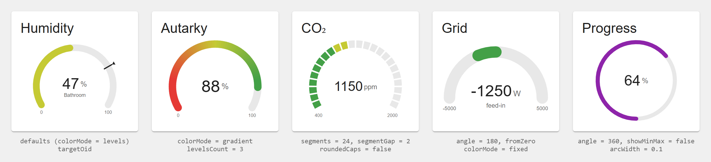

| Einstellung | Attribut | Standard | Beschreibung |
|---|---|---|---|
| Winkel der Skala | `angle` | 240 | 180 ist ein Halbkreis, 360 ein voller Ring. |
| Drehung | `rotate` | 0 | |
| Bogenbreite | `arcWidth` | 0,16 | Dicke als Anteil am Radius. |
| Abgerundete Enden | `roundedCaps` | an | |
| Farbe der Spur | `trackColor` | hellgrau | Der leere Teil des Bogens. |
| Segmente | `segments` | 0 | 0: ein durchgehender Bogen. Mehr: so viele Segmente; jedes leuchtende Segment bekommt die Farbe seiner eigenen Stelle auf der Skala. |
| Abstand der Segmente | `segmentGap` | 2 | In Grad. |
| Bei null beginnen | `fromZero` | aus | Reicht die Skala unter null, beginnt der Bogen bei 0 und wächst in beide Richtungen - z. B. für die Leistung am Netzanschluss. |
| Einfärbung | `colorMode` | Farbe der Stufe | Siehe [Farben und Stufen](#farben-und-stufen). |
| Farbe | `valueColor` | blau | Für *Eine Farbe*. |
| Anzahl der Stufen | `levelsCount` | 3 | |
| Wert zeigen | `showValue` | an | |
| Textfarbe | `textColor` | Textfarbe | |
| Größe des Werts | `valueSize` | 0,36 | Schriftgröße als Anteil am Radius; lange Texte werden kleiner, damit sie passen. |
| Text unter dem Wert | `subText` | | z. B. `Bad`. |
| Minimum und Maximum zeigen | `showMinMax` | an | Unter den Enden des Bogens. |
| Objekt-ID Sollwert | `targetOid` | | Optional: eine Markierung bei diesem Wert. |
| Farbe der Markierung | `targetColor` | Textfarbe | |
| Animation | `animate`, `animateDuration`, `animationEasing` | an, 800, `cubicOut` | |

## Linearanzeige - `tplGauge2Linear`

Ein waagerechter oder senkrechter Balken mit Skala.

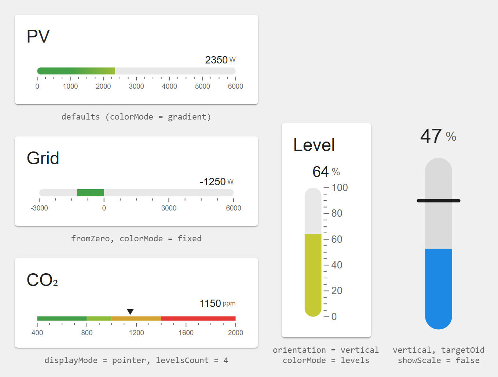

| Einstellung | Attribut | Standard | Beschreibung |
|---|---|---|---|
| Ausrichtung | `orientation` | waagerecht | `vertical`: das Minimum ist unten. |
| Darstellung | `displayMode` | Balken | `bar`: ein gefüllter Balken. `pointer`: die Stufen sind auf der ganzen Skala zu sehen und ein Dreieck zeigt auf den Wert. |
| Balkenstärke | `barSize` | 0,8 | Als Anteil am freien Platz. |
| Abgerundet | `rounded` | an | Runde Enden des Balkens. |
| Farbe der Spur | `trackColor` | hellgrau | Der leere Teil des Balkens. |
| Bei null beginnen | `fromZero` | aus | Siehe Bogenanzeige. |
| Skala zeigen | `showScale` | an | Unter dem Balken, senkrecht rechts davon. |
| Hauptteilungen / Zwischenteilungen | `majorTicks` / `minorTicks` | 5 / 4 | |
| Farbe der Skala | `scaleColor` | grau | |
| Einfärbung | `colorMode` | Verlauf der Stufen | Mit Verlauf deckt der Balken die Farben der Skala auf. |
| Farbe | `valueColor` | blau | |
| Anzahl der Stufen | `levelsCount` | 3 | |
| Wert zeigen | `showValue` | an | Über dem Balken, rechts. |
| Textfarbe | `textColor` | Textfarbe | Auch die Farbe des Zeigers. |
| Objekt-ID Sollwert | `targetOid` | | Optional: ein Strich quer über den Balken bei diesem Wert. |
| Farbe der Markierung | `targetColor` | Textfarbe | |
| Animation | `animate`, `animateDuration`, `animationEasing` | an, 800, `cubicOut` | |

## Thermometer - `tplGauge2Thermometer`

Ein Glasthermometer mit Skala.

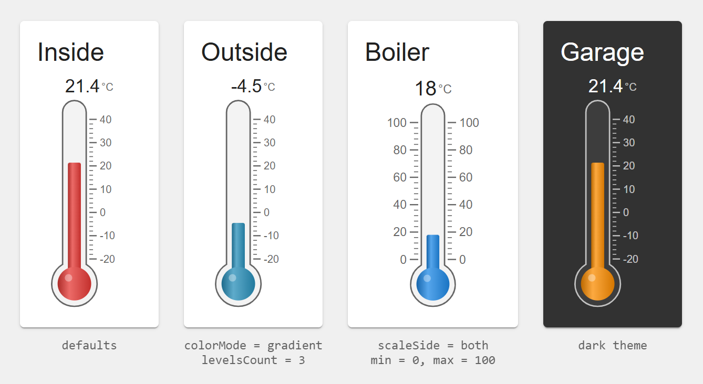

| Einstellung | Attribut | Standard | Beschreibung |
|---|---|---|---|
| Minimum / Maximum | `min` / `max` | -20 / 40 | |
| Einheit | `unit` | °C | |
| Nachkommastellen | `digitsAfterComma` | 1 | |
| Seite der Skala | `scaleSide` | Rechts | `left`, `right` oder `both`. |
| Hauptteilungen / Zwischenteilungen | `majorTicks` / `minorTicks` | 6 / 5 | Bei -20 ... 40: alle 10° eine Zahl, alle 2° ein Strich. |
| Farbe der Skala | `scaleColor` | grau | |
| Farbe des Glases | `tubeColor` | grau | |
| Einfärbung | `colorMode` | Eine Farbe | Mit *Farbe der Stufe* oder *Verlauf* ändert die Säule ihre Farbe mit der Temperatur (Standardstufen: blau bis rot). |
| Farbe | `valueColor` | rot | |
| Wert zeigen / Textfarbe | `showValue` / `textColor` | an / Textfarbe | Der Wert über dem Thermometer. |
| Animation | `animate`, `animateDuration`, `animationEasing` | an, 1000, `cubicInOut` | |

## Kompass - `tplGauge2Compass`

Eine Kompassrose für eine Richtung, z. B. die Windrichtung oder die Fahrtrichtung eines Mähroboters, auf Wunsch mit
einer Geschwindigkeit in der Mitte.

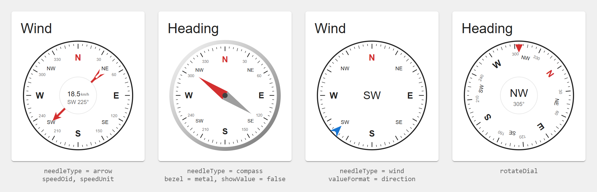

| Einstellung | Attribut | Standard | Beschreibung |
|---|---|---|---|
| Objekt-ID | `oid` | | Richtung in Grad: 0 ist Norden, 90 Osten. |
| Abweichung nach Norden | `offset` | 0 | Wird zum Wert addiert, z. B. wenn der Sensor nicht genau nach Norden zeigt. |
| Zeigen, wohin es geht | `invert` | aus | Eine Windrichtung sagt, **woher** der Wind kommt. Mit dieser Option zeigt die Nadel, wohin er weht (+180°). |
| Objekt-ID Geschwindigkeit | `speedOid` | | Optional: wird in der Mitte angezeigt. Beim Auswählen wird die Einheit übernommen. |
| Einheit | `speedUnit` | | |
| Nachkommastellen | `speedDigits` | 1 | |
| Nadel | `needleType` | Pfeil | `arrow` zeigt auf die Richtung, `compass` ist eine zweifarbige Kompassnadel, `wind` eine Markierung am Rand, die zur Mitte zeigt. |
| Zifferblatt drehen | `rotateDial` | aus | Das Zifferblatt dreht sich und eine feste Marke oben zeigt die Richtung, wie ein Kompass im Auto. |
| Nadelfarbe | `needleColor` | rot | |
| Farbe von Norden | `northColor` | rot | |
| Farbe des Zifferblatts | `dialColor` | weiß / dunkel | |
| Farbe der Skala | `scaleColor` | Textfarbe | |
| NO, SO, SW, NW zeigen | `showIntercardinal` | an | |
| Gradzahlen zeigen | `showDegrees` | an | 30, 60, 120, ... |
| Rand | `bezel` | Dünne Linie | `none`, `thin` oder `metal`. |
| Wert zeigen | `showValue` | an | |
| Anzeige | `valueFormat` | Richtung und Grad | `both` (`SW 225°`), `direction` (`SW`) oder `degrees` (`225°`). Mit Geschwindigkeit ist das die Zeile darunter. |
| Textfarbe | `textColor` | Textfarbe | |
| Animation | `animate`, `animateDuration`, `animationEasing` | an, 1000, `cubicInOut` | Immer auf dem kurzen Weg: von 350° nach 10° über Norden. |

Die Namen der Richtungen folgen der Sprache von vis-2 (auf Deutsch N, NO, O, SO, S, SW, W, NW).

## Tank - `tplGauge2Tank`

Der Füllstand eines Tanks, einer Zisterne oder eines Pelletlagers.

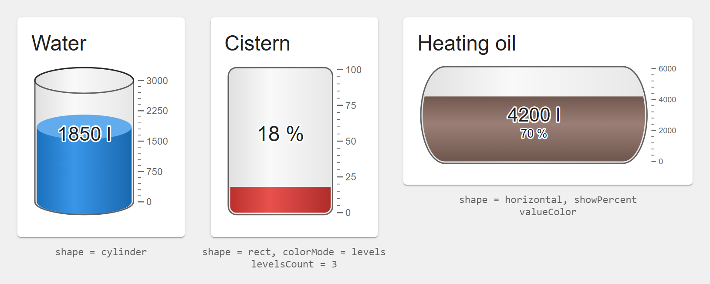

| Einstellung | Attribut | Standard | Beschreibung |
|---|---|---|---|
| Nachkommastellen | `digitsAfterComma` | 0 | |
| Form | `shape` | Stehender Zylinder | `cylinder`, `rect` (Rechteck) oder `horizontal` (liegender Tank, z. B. für Heizöl). Die Füllhöhe ist proportional zum Wert. |
| Farbe des Tanks | `tankColor` | grau | Umriss des Tanks. |
| Wellenanimation | `waveAnimation` | an | Eine langsam bewegte Oberfläche; nur Rechteck und liegender Tank. |
| Skala zeigen / Haupt- / Zwischenteilungen | `showScale` / `majorTicks` / `minorTicks` | an / 4 / 5 | Rechts neben dem Tank. |
| Farbe der Skala | `scaleColor` | grau | |
| Einfärbung | `colorMode` | Eine Farbe | Mit Stufen z. B. rot, wenn der Tank fast leer ist (Standardstufen: rot bis grün). |
| Farbe | `valueColor` | blau | |
| Wert zeigen | `showValue` | an | In der Mitte des Tanks. |
| Prozent zeigen | `showPercent` | aus | Der Füllstand in Prozent unter dem Wert. |
| Textfarbe | `textColor` | Textfarbe | |
| Animation | `animate`, `animateDuration`, `animationEasing` | an, 1200, `cubicInOut` | |

## Ringe - `tplGauge2Rings`

Bis zu fünf Werte als konzentrische Ringe - z. B. PV-Leistung, Hausverbrauch und Batterieladung.

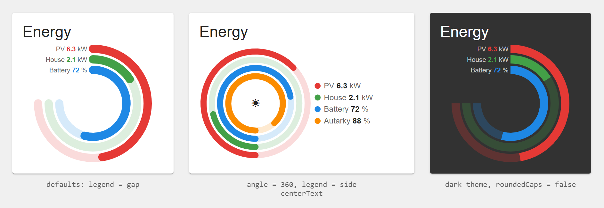

| Einstellung | Attribut | Standard | Beschreibung |
|---|---|---|---|
| Anzahl der Ringe | `ringsCount` | 3 | 1 bis 5. |
| Winkel der Skala | `angle` | 270 | |
| Drehung | `rotate` | 135 | Mit 270° und 135 beginnen die Ringe oben und lassen das linke obere Viertel frei. |
| Ringbreite | `ringWidth` | 0,14 | Breite eines Rings als Anteil am Radius. |
| Abstand zwischen Ringen | `ringGap` | 0,04 | |
| Abgerundete Enden | `roundedCaps` | an | |
| Deckkraft der Spur | `trackOpacity` | 0,18 | Der leere Teil eines Rings wird in seiner Farbe mit dieser Deckkraft gezeichnet. |
| Legende | `legend` | Im freien Viertel | `gap`: rechtsbündig vor dem Anfang jedes Rings - braucht Ringe, die oben beginnen, und einen Winkel bis 300°, sonst steht die Legende neben den Ringen. `side`: neben den Ringen, in einem schmalen Widget darunter. `none`. |
| Text in der Mitte | `centerText` | | |
| Textfarbe | `textColor` | Textfarbe | |

Jeder Ring (Gruppe *Ring 1*, *Ring 2*, ...):

| Einstellung | Attribut | Standard | Beschreibung |
|---|---|---|---|
| Objekt-ID | `oid1` ... | | |
| Beschriftung | `label1` ... | | |
| Minimum / Maximum | `min1` / `max1` ... | 0 / 100 | |
| Einheit | `unit1` ... | | |
| Nachkommastellen | `digits1` ... | | |
| Farbe | `color1` ... | rot, grün, blau, orange, violett | |
